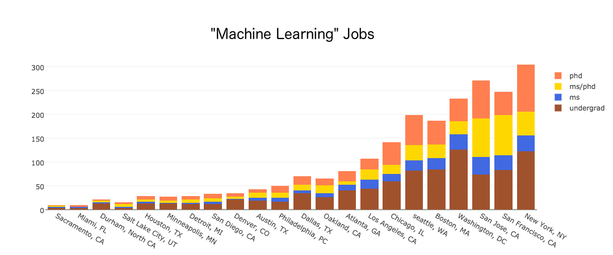

# Grad-Job-Classification
View the market for University Degrees

## Prerequisites
- Python 3
- Docker
## Install
```
pip3 install -r requirements.txt
```
Edit ```config.ini``` with your indeed publisher number. If you do not have a publisher number, you can receive one by heading to the [Indeed Publisher Portal](http://www.indeed.com/publisher).
```
[INDEED]
PublisherNumber = <Indeed_Publisher_Numer_Here>
```
## Usage
Run a mongo instance
```
docker-compose up
```
Run a task
```
python3 grad_job_classification.py <Task>
```
### Example Tasks
Scrape job data for "machine learning"
```
python3 grad_job_classification.py scrape "machine learning"
```
Visualize job data for "machine learning"
```
python3 grad_job_classification.py analyse "machine learning"
```
